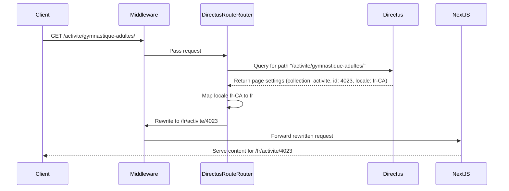

# ADR 001: Directus Dynamic Routing Integration

## Status
Implemented

## Context
The `directusRouteMiddleware` function in our stack project needs refactoring to enhance its dynamic routing
capabilities. The primary goal is to create a more flexible and efficient routing system that can:

1. Accept an incoming user-friendly path (e.g., "/activite/gymnastique-adultes/").
2. Query Directus to find the corresponding page settings for this path.
3. Extract essential information from the Directus response, including:
   - The appropriate collection (e.g., "activite")
   - The correct identifier for the content (e.g., id: 4023)
   - The associated locale (e.g., "fr-CA")
4. Map the Directus locale to the desired NextJS locale if necessary (e.g., "fr-CA" to "fr").
5. Rewrite the path to a standardized format: `/[mappedLocale]/[collectionName]/[id]`.

This refactoring aims to streamline the routing process, eliminate the need for separate i18n middleware, and provide
a consistent approach across various Okam projects using the stack.

## Decision
We will refactor the `directusRouteMiddleware` function, renaming it to `directusRouteRouter`, and modify its
approach to routing. The new implementation will:

1. Directly query Directus for page settings translations based on the requested path.
2. Infer the language from the matched translation.
3. Allow for custom mapping between Directus locales and NextJS locales, with a fallback to the Directus locale.
4. Support collection-specific settings, particularly for defining custom 'id' field names.
5. Rewrite the path to the format `/[mappedLocale]/[collectionName]/[id]`.
6. Provide verbose logging in development mode for easier debugging.
7. Remove the `config` export, allowing projects to define their own matcher in their `middleware.ts` file.
8. Move the router from the directus-next-component package to the directus-next package.

## Changes
1. Rename `directusRouteMiddleware` to `directusRouteRouter`.
2. Modify the GraphQL query to search for translations directly based on the path.
3. Extract locale information from the matched translation.
4. Implement a configuration object that includes an optional locale mapping and collection-specific settings.
5. Use the locale mapping to convert Directus locales to desired NextJS locales, falling back to the Directus locale
if no mapping is provided or found.
6. Use collection-specific settings to determine the correct 'id' field for each collection.
7. Implement path rewriting to the new format: `/[mappedLocale]/[collectionName]/[id]`.
8. Add error handling for not found (404) and server error (500) cases.
9. Implement verbose logging in development mode.
10. Remove the `config` export, allowing for more flexibility in project-specific configurations.
11. Move the router from the directus-next-component package to the directus-next package.

## Implementation Details
1. Update the GraphQL query in `fetchPageSettingsTranslation` to search translations directly based on the path.
2. Modify `directusRouteRouter` to use the new query and extract necessary information.
3. Implement a `DirectusRouteConfig` interface that includes:
   - An optional `localeMap`
   - A `collectionSettings` object for collection-specific configurations
4. Use the `localeMap` to convert Directus locales to NextJS locales when rewriting paths, falling back to the
Directus locale if necessary.
5. Use the `collectionSettings` to determine the correct 'id' field for each collection when rewriting paths.
6. Implement path rewriting based on the extracted and mapped information.
7. Add error handling for 404 and 500 cases.
8. Implement verbose logging for development environments.
9. Remove the `config` export from the `directusRouteRouter` file.
10. Move the router implementation from the directus-next-component package to the directus-next package.

## Example Usage
```typescript
// In the project's middleware.ts file
import { NextRequest } from 'next/server';
import { directusRouteRouter } from '@okam/directus-next/server';

const config = {
  localeMap: {
    'en-US': 'en',
    'fr-CA': 'fr',
    'es-ES': 'es',
  },
  collectionSettings: {
    activite: {
      idField: 'friendly_id',
    },
    default: {
      idField: 'id',
    }
  }
};

export function middleware(request: NextRequest) {
  return directusRouteRouter(request, config);
}

export const config = {
  matcher: [
    '/((?!api|_next/static|_next/image|favicon.ico).*)',
  ],
}
```



## Notes
- This change prepares the ground for future caching implementations, which will be addressed in a separate ADR.
- Projects using this stack will need to update their `middleware.ts` files to include the necessary configuration
and matcher.
- Verbose logging is only active in development mode to aid in debugging without affecting production performance.
- The `collectionSettings` object allows for future expansion of collection-specific configurations beyond just the
'id' field.
- The router has been moved from the directus-next-component package to the directus-next package for better
organization.

## Next Steps
1. Update documentation for projects using the stack, including guidance on how to configure the middleware, use the
new locale mapping feature, set up collection-specific settings, and interpret development logs.
2. Consider caching strategies to optimize performance (to be addressed in a future ADR).
3. Gather feedback from projects using the stack to ensure the new implementation meets their needs.
4. Provide examples and best practices for configuring the middleware in different project scenarios.
5. Investigate and plan for the implementation of a "reverse" routing feature.

## Reference
### GraphQL Query

```graphql
query Languages_code($filter: page_settings_translations_filter) {
  page_settings_translations(filter: $filter) {
    languages_code {
      name
    }
    id
    page_settings_id {
      belongs_to_collection
      belongs_to_key
    }
    title
    slug
    path
  }
}
```

### Complete payload (example):
```json
{
    "query": "query Languages_code($filter: page_settings_translations_filter) {\n  page_settings_translations(filter: $filter) {\n    languages_code {\n      name\n    }\n    id\n    page_settings_id {\n      belongs_to_collection\n      belongs_to_key\n    }\n    title\n    slug\n    path\n  }\n}",
    "variables": {
        "filter": {
            "path": {
                "_eq": "/news/vanier-s-nathan-zsombor-murray-wins-an-olympic-bronze-medal-in-diving"
            },
            "_and": [
                {
                    "page_settings_id": {
                        "belongs_to_key": {
                            "_nempty": true
                        }
                    }
                }
            ]
        }
    },
    "operationName": "Languages_code"
}
```

## Future Considerations

### Reverse Routing Feature
We should consider implementing a "reverse" routing feature as an enhancement to our current routing system. This
feature would work as follows:

1. When a user accesses a URL in the format `/[locale]/[collection]/[id]` directly, the system would:
   a. Recognize this format.
   b. Query the Directus API to find the corresponding page_settings for this entity.
   c. If a user-friendly path is found in the page_settings, perform a redirect to that path.

#### Potential Implementation:
```typescript
async function reverseRouting(request: NextRequest, config: DirectusRouteConfig) {
  const { pathname } = request.nextUrl
  const match = pathname.match(/^\/([^\/]+)\/([^\/]+)\/([^\/]+)$/)

  if (match) {
    const [, locale, collection, id] = match

    // Use collection-specific id field if defined
    const idField = config.collectionSettings[collection]?.idField || config.collectionSettings.default.idField ||
'id'

    // Query Directus for the user-friendly path
    const userFriendlyPath = await fetchUserFriendlyPath(collection, id, locale, config, idField)

    if (userFriendlyPath) {
      // Perform redirect
      return NextResponse.redirect(new URL(userFriendlyPath, request.url))
    }
  }

  // If no match or no user-friendly path found, continue with normal routing
  return directusRouteRouter(request, config)
}
```

#### Benefits:
1. Improved user experience with more readable URLs.
2. Consistency in URL structure across the application.
3. Better SEO as search engines would only index the user-friendly URLs.
4. Supports custom 'id' fields for different collections.

#### Challenges:
1. Additional database query for each reverse routing check, which could impact performance.
2. Need to ensure proper handling of locale variations and mappings.
3. Potential for redirect loops if not implemented carefully.
4. Increased complexity in handling different 'id' fields for various collections.

#### Next Steps for Reverse Routing:
1. Conduct a detailed design review for the reverse routing feature.
2. Assess the performance implications and consider caching strategies.
3. Implement a prototype and test with various scenarios, including different collection configurations.
4. Update the `directusRouteRouter` function to incorporate reverse routing logic.
5. Provide documentation and examples for using the reverse routing feature with collection-specific settings.
6. Consider making this an optional feature that can be enabled/disabled via configuration.

By implementing this reverse routing feature, we would create a more robust and user-friendly routing system that
handles both directions of URL resolution, further enhancing the flexibility and power of our Directus integration
while accommodating diverse collection structures.
